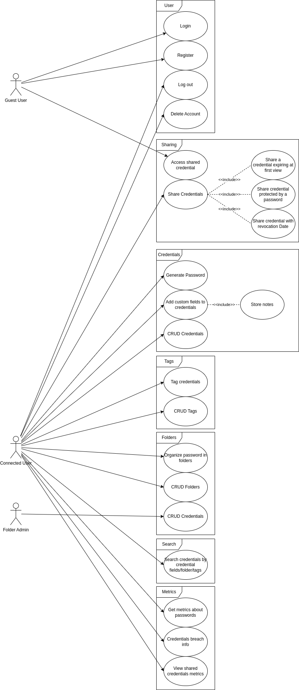

= Polypass Architecture
The polypass team
:toc:

== Breakdown

This part concerns the features we want to implement in the Polypass system.

include::src/drafts/lexicon.adoc[]

=== User Management

As a user:

- I want to create an account.
- I want to log in to my account.
- I want to log out of my account.
- I want to delete my account.

=== Credentials Management

As a user:

- I want to store the credentials of a website I am using.
- I want to tag my credentials for better organization.
- I want to generate a secure password.
- I want to add context or custom fields to my credentials.

[mermaid, format="svg"]
----
flowchart TD
    User["User"] --> |Store| A["Website credentials"]
    User --> |Tag| B["Organize credentials"]
    User --> |Generate| C["Secure password"]
    User --> |Add| D["Context or custom fields"]
----

=== Credentials Sharing

As a user:

- I want to share my credentials with another user.
- I want to set the date of revocation of the shared credentials.
- I want to set the credential to be only seen once.
- I want to define a passphrase for the shared credentials.

As a guest:

- I want to be able to use the passphrase to see the shared credentials.
- I want to be able to copy/paste any field of the shared credentials.

[mermaid, format="svg"]
----
flowchart TD
    User["User"] --> |Share| A["Share credentials"]
    A --> |Set| B["Date of revocation"]
    A --> |Set| C["View-once credential"]
    A --> |Define| D["Passphrase"]
    Guest["Guest"] --> |Use| D
    Guest --> |Copy/Paste| E["Shared credentials fields"]
----

=== Encrypted Files

As a user:

- I want to take notes securely.
- I want to store files securely.

[mermaid, format="svg"]
----
flowchart TD
    User["User"] --> |Take notes| A["Secure notes"]
    User --> |Store| B["Secure files"]
----

=== Organization

As a user:

- I want to organize my credentials using folders or tags.
- I want to create, rename, or delete folders or tags.
- I want to move credentials between folders or tags.
- I want to view my credentials in a tree structure based on folders or tags.

[mermaid, format="svg"]
----
flowchart TD
    User["User"] --> |Organize| A["Folders or tags"]
    A --> |Create/Rename/Delete| B["Manage folders or tags"]
    A --> |Move| C["Credentials between folders or tags"]
    A --> |View| D["Tree structure"]
----

=== Search

As a user:

- I want to search for a credential by its name.
- I want to search for a credential by its tag.
- I want to search for a credential by its website.

[mermaid, format="svg"]
----
flowchart TD
    User["User"] --> |Search by| A["Credential name"]
    User --> |Search by| B["Credential tag"]
    User --> |Search by| C["Website"]
----

=== Insights

As a user:

- I want to see statistics about my passwords, such as:
    - Old passwords.
    - Reused passwords.
    - Weak passwords.
- I want to know if my credentials has been breached.
- I want to view credential usage statistics for a group, such as:
    - credential creation trends.
    - credential usage trends.

[mermaid, format="svg"]
----
flowchart TD
    User["User"] --> |View| A["Credential statistics"]
    A --> |See| B["Old/Reused/Weak credentials"]
    A --> |Check| C["Breached logins or credentials"]
    A --> |View| D["Group usage statistics"]
    D --> |Analyze| E["Creation trends"]
    D --> |Analyze| F["Usage trends"]
----

=== Full use cases view

