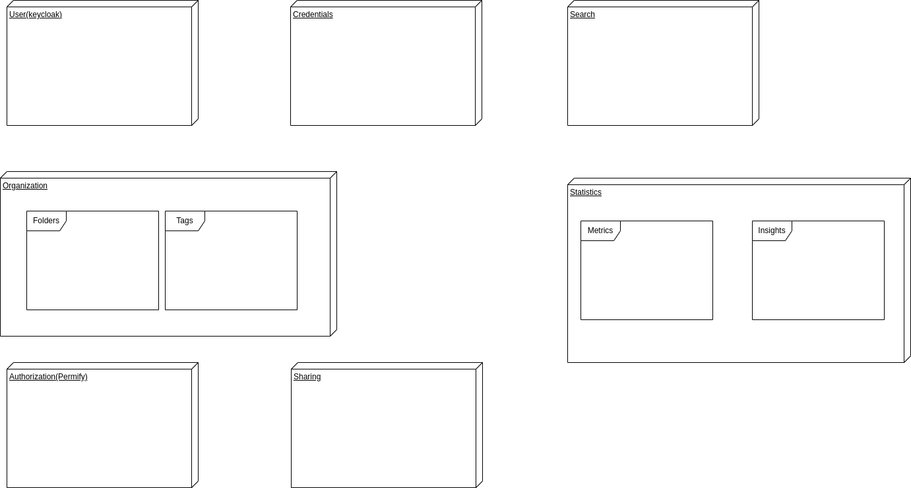

= Polypass Architecture
The polypass team
:toc:

== Breakdown

This part concerns the features we want to implement in the Polypass system.

include::src/drafts/lexicon.adoc[Lexicon]

=== User Management

As a guest user:

- I want to create an account.
- I want to log in to my account.

As a connected user:

- I want to log out of my account.
- I want to delete my account.
- I want to be able to change my password.
- I want to be able to change my email address.

=== Credentials Management

As a connected user:

- I want to store the credentials of a website I am using.
- I want to generate a secure password.
- I want to add custom fields to my credentials.
- I want to add a note to my credentials.
- I want to search for credentials by name, websites, identifier and custom fields.
- I want to provide a Master Key to encrypt my credentials.
- I want to view credentials in a tree structure based on folders or tags.

ifdef::env-github[]
[source,mermaid]
endif::[]
ifndef::env-github[]
[mermaid]
endif::[]
....
flowchart TD
    User["User"] --> |Store| A["Website credentials"]
    User --> |Tag| B["Organize credentials"]
    User --> |Generate| C["Secure password"]
    User --> |Add| D["Context or custom fields"]
....

Here is a class diagram to better understand the relationship between the different entities: 

ifdef::env-github[]
[source,mermaid]
endif::[]
ifndef::env-github[]
[mermaid]
endif::[]
....
---
title: Polypass credentials data structure
---
classDiagram
     class Credential{
         +String Website
         +String Login
         +String Password
     }
     note for User "this model will not be detailled since its not the goal of this documentation"
     class User{
          +String Email
          +String Password
     }
     class Folder{
         +String Name
      }
      class Tag{
           +String Name
           +String color
      }
     Folder "1" --> "0..*" Folder : Contains
     User "1" --> "*" Credential
     Credential "*" --> "*" Tag
     Credential "1" --> "*" Folder
....

=== Credentials Tagging

As a connected admin user:

- I want to tag credentials.
- I want to create, update, or delete my tags.

As a connected viewer:

- I want to search for credentials by tag.

=== Credentials Sharing

As a connected admin user:

- I want to share a credential with a guest user.
- I want to set the date of revocation of the shared credentials.
- I want to set the credential to be only seen one time.
- I want to define a passphrase for the shared credentials.

As a guest:

- I want to access the shared credentials.
- I want to be able to use the passphrase to see the shared credentials.
- I want to be able to copy/paste any field of the shared credentials.

ifdef::env-github[]
[source,mermaid]
endif::[]
ifndef::env-github[]
[mermaid]
endif::[]
....
flowchart TD
    User["User"] --> |Share| A["Share credentials"]
    A --> |Set| B["Date of revocation"]
    A --> |Set| C["View-once credential"]
    A --> |Define| D["Passphrase"]
    Guest["Guest"] --> |Use| D
    Guest --> |Copy/Paste| E["Shared credentials fields"]
....

=== Folder

As a connected user:

- I want to create a folder if I am not into a folder.
- I want to accept invitations to join a folder.

As a connected admin user:

- I want to create, update and delete a folder.
- I want to invite a user to a folder.

As a connected viewer:

- I want to view the folders.
- I want to search for credentials by folder.

[mermaid, format="svg"]

ifdef::env-github[]
[source,mermaid]
endif::[]
ifndef::env-github[]
[mermaid]
endif::[]
....
flowchart TD
    User["User"] --> |Organize| A["Folders or tags"]
    A --> |Create/Rename/Delete| B["Manage folders or tags"]
    A --> |Move| C["Credentials between folders or tags"]
    A --> |View| D["Tree structure"]
....

=== Insights

As a connected viewer:

- I want to see statistics about my passwords, such as:
    - Old passwords.
    - Reused passwords.
    - Weak passwords.
- I want to know if my credentials has been breached.

As a connected admin user:
- I want to view credential usage statistics for a group, such as:
    - credential creation trends.
    - credential usage trends.
- I want to view the credential usage statistics for shared credentials.

ifdef::env-github[]
[source,mermaid]
endif::[]
ifndef::env-github[]
[mermaid]
endif::[]
....
flowchart TD
    User["User"] --> |View| A["Credential statistics"]
    A --> |See| B["Old/Reused/Weak credentials"]
    A --> |Check| C["Breached logins or credentials"]
    A --> |View| D["Group usage statistics"]
    D --> |Analyze| E["Creation trends"]
    D --> |Analyze| F["Usage trends"]
....

=== Full use cases view

image::src/diagrams/use-case.drawio.png[Use cases, 100%, 100%]

